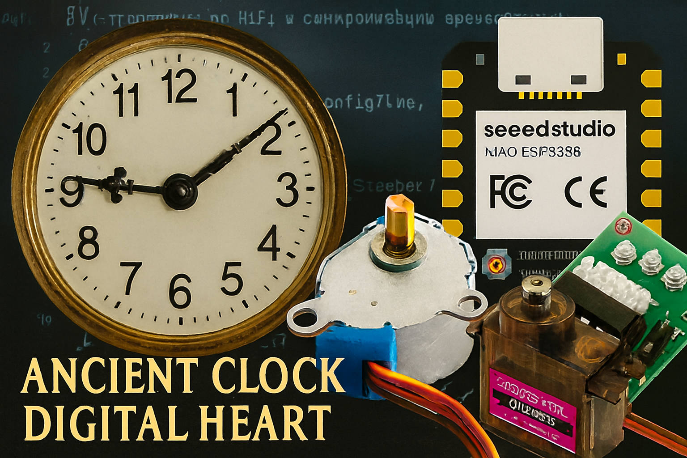
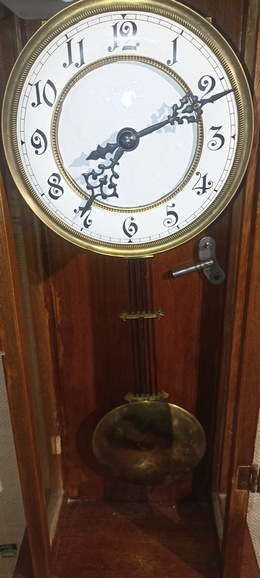

# 🕰️ **Welcome to the Ancient Clock Digital Heart project**

Проект возрождения замершего механического сердца старинных часов. Теперь это не просто часы. Это инженерная поэма, где каждый удар молоточка, каждый шаг мотора — отбивают пульс цифровой эпохи.

**Version: v1.1.1**
Артефакт готов для установки на своё законное место.

---
## 🛠️ Аппаратная часть

- **"Цифровое сердце"**: [SeedStudio XIAO ESP32S3](https://github.com/Rednaxela-beep/clock/blob/master/assets/photos/e-components/Seeed%20Studio%20Xiao%20ESP32%20FrontV_cr.png)  
- **RTC модуль**: [DS3231](https://github.com/Rednaxela-beep/clock/blob/master/assets/photos/e-components/RTC%20DS3231.jpg)  
- **Шаговый мотор стрелок**: [28BYJ-48 + ULN2003](https://github.com/Rednaxela-beep/clock/blob/master/assets/photos/e-components/28BYJ-48%2BULN2003.png)  
- **Сервопривод боя**: [MG90](https://github.com/Rednaxela-beep/clock/blob/master/assets/photos/e-components/mg90servo.jpeg)  
- **Микрик-концевик**: для корректировки стрелки  
- **Питание**: [PB-2606 5000 mAh, DC 5V/3A](https://github.com/Rednaxela-beep/clock/blob/master/assets/photos/e-components/pb-2606_harper_powerbank.jpeg)

---

📁 [Галерея проекта](https://github.com/Rednaxela-beep/clock/tree/master/assets/photos) — все иллюстрации в одном каталоге


## 📦 Состав проекта

| Файл            | Назначение                                      |
|-----------------|--------------------------------------------------|
| `main.cpp`      | FSM-логика, бой, стрелки, синхронизация         |
| `arrow.cpp`     | Управление шаговиком 28BYJ-48                   |
| `chimes.cpp`    | Молоточек MG90, бой по часам                    |
| `wi-fi.cpp`     | Подключение к Wi-Fi, NTP-синхронизация          |
| `ota.cpp`       | OTA-обновление по Wi-Fi, дух прошивки           |
| `web-monitor.cpp` | Веб-интерфейс для мониторинга и команд        |
| `debug.cpp`     | Expressive логирование, ритуальные метки        |
| `version.h`     | Текущая версия прошивки                         |

---

## 🚀 Сетевые функции
Контроллер подключается к определенной в файле secret.h переменными WIFI_SSID и WIFI_PASSWORD сети Wi-Fi.

⚠️ Для этого необходимо скопировать secret.example.h в secret.h и определить в нём SSID и пароль сети.

Web-монитор доступен по адресу http://clock.local в пределах одной подсети. 

Контроллер часов принимают прошивку по Wi-Fi:
```bash
python espota.py -i <IP> -p 3232 --auth=<пароль> --file CLOCK.ino.bin
```
📸 [Галерея проекта](https://github.com/Rednaxela-beep/clock/tree/master/assets/photos) — реальные фото компонентов и артефактов



